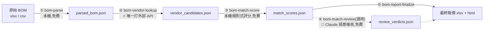

# bom_mouser_price_check — BOM → 比價 Pipeline(Mouser + DigiKey)

讀取一份產品 BOM(xlsx/csv),依序查詢 Mouser、必要時 fallback 查 DigiKey,
比對是否為同一料件並產出信心分數,規則式評分卡住的模糊案例可以再交給 Claude
在對話中親自複核(不呼叫付費 API),最後輸出一份 xlsx 比價報表(含單價總價、
含 MOQ 的預算評估、Top 10 高價料件)。



只有 ② 真的對外查詢,而且有本機快取(同一顆料不會重複查)。改了廠商對照表
想重新評分、或有新的 Claude 判決,重跑 ③⑤ 就好,不用碰 ②。

## 這個專案在意什麼

送往 Mouser/DigiKey 的 payload **只有 MPN**,或缺 MPN 時由
`manufacturer + value + package + tolerance` 組成的關鍵字——一律是元件本身
的技術屬性。**`ref_des`(位號)、專案代號、客戶名稱一律不會離開你的電腦**,
查詢完成後才在本機重新合併回結果。細節見 [ARCHITECTURE.md](ARCHITECTURE.md#2-bom-資料最小化)。

## 前置需求

| 需要什麼 | 說明 |
| --- | --- |
| **Python 3.10 以上** | 程式用到 `str \| None` 這種新語法,3.9 以下會直接語法錯誤 |
| **Mouser Search API Key** | 必填,免費申請:[mouser.com/api-search](https://www.mouser.com/api-search/) |
| DigiKey Client ID / Secret | 選填,免費申請:[developer.digikey.com](https://developer.digikey.com/products/product-information-v4)。沒有的話 Mouser 查不到的料件就不會再往下查 |
| **Claude Code** | 只有第 ④ 步(Claude 語意複核)需要。其餘四步都是可以直接跑的 Python 腳本,沒有 Claude Code 也能用——詳見〈怎麼用〉 |

## 安裝

### 方式 A:整包 clone 下來當專案目錄用(建議)

最單純,五個 skill 會自動被 Claude Code 讀到:

```bash
git clone <這個 repo 的網址> bom-mouser
cd bom-mouser
python -m venv .venv
```

啟用虛擬環境(Windows PowerShell 用 `.venv\Scripts\Activate.ps1`,
macOS/Linux 用 `source .venv/bin/activate`),然後:

```bash
pip install -r requirements.txt
```

接著建立 `.env`。Windows `cmd` 用 `copy`,PowerShell 與 macOS/Linux 用 `cp`:

```bash
cp .env.example .env
```

打開 `.env` 填入 `MOUSER_SEARCH_API_KEY`(必填)。
DigiKey 那兩個選填,沒填就只查 Mouser。
**人在台灣以外的話,記得看一下 `.env.example` 裡的 `DIGIKEY_LOCALE_*`**
——預設是 TW/TWD,不改的話 DigiKey 會回你台幣報價。

### 方式 B:把 skill 複製進你自己的專案

如果你已經有自己的專案目錄,想在那裡用這五個 skill:

```bash
cp -r bom-mouser/.claude/skills/bom-* your-project/.claude/skills/
cp bom-mouser/mouser_lookup.py bom-mouser/manufacturer_aliases.md your-project/
cp -r bom-mouser/adapters your-project/
```

`mouser_lookup.py` 跟 `manufacturer_aliases.md` **一定要一起複製**——五個
skill 的腳本都是靠相對路徑 import 專案根目錄的 `mouser_lookup.py`,而它
執行時又會讀同目錄的 `manufacturer_aliases.md`。`.env` 也放在同一個根目錄。

> **注意**:macOS/Linux 上如果 `python` 指到 Python 2 或不存在,以下所有指令
> 把 `python` 換成 `python3`。

## 確認裝好了:先跑本機自測

不需要任何 API 憑證,也不會連網:

```bash
python test_pipeline.py
```

看到最後一行 **`全部自測通過 ✅`** 就代表環境沒問題,可以往下走。
中途出現 `AssertionError` 就是有東西壞了,不要繼續。

## 快速開始:五分鐘走完全流程

倉庫附了一份假資料的示範 BOM,可以先拿它熟悉流程:

```bash
python mouser_lookup.py examples/sample_bom.csv --limit 5
```

換成你自己的 BOM:

```bash
python mouser_lookup.py your_bom.xlsx
```

**第一次跑一份新的 BOM,強烈建議先加 `--limit 5` 小批量測試**,確認欄位
有對到再跑整份——不然欄位對錯了,整份 BOM 的查詢額度就白花了。

不指定 `-o` 的話,會自動建立「今天日期_BOM檔名」資料夾(例如
`20260814_your_bom/`),xlsx 跟同檔名的 `.html`(給人看的視覺化摘要:
總價、配對狀況分布、Top 10 排行,數字跟 xlsx 保證一致,不需要的話加
`--no-html`)都放進去——不管是這支一次到底的 CLI,還是透過 skill 走
(見下面〈怎麼用〉),都是同一套資料夾規則,兩個人各自處理不同 BOM
不會撞名互相覆蓋。要指定固定路徑就加 `-o report.xlsx`。

### 我的 BOM 跑出來 mpn 整欄都是空的

先分辨是哪一種狀況,兩種解法完全不同:

- **欄位「名稱」對不上**(原始 BOM 有獨立的型號/廠商欄,只是叫別的名字)
  → 到 `mouser_lookup.py` 的 `_COLUMN_ALIASES` 加個別名就好,見
  [CONTRIBUTING.md](CONTRIBUTING.md)
- **一格塞了多個屬性**(型號、廠牌、備註全塞在同一個「规格型号」儲存格裡,
  被動元件甚至完全沒有型號)→ **加別名永遠解不了**,要改用
  [adapters/](adapters/README.md) 的前處理腳本

## 怎麼用:五個 Skill,或直接跑 CLI

**Claude Code skill** 就是放在 `.claude/skills/<名字>/SKILL.md` 的一份
markdown 說明書。在 Claude Code 裡開這個專案時,Claude 會自動看到這些
skill;你說的話符合某個 skill 的觸發條件(例如「幫我報價這份 BOM」),
它就會自動照步驟做事,不需要記指令。

**不用 Claude Code 也能用**——每個 skill 底下的 `scripts/run.py` 都是
普通的 Python 腳本,可以自己在終端機跑(各 SKILL.md 裡都有指令);上面
`mouser_lookup.py your_bom.xlsx` 這種一次到底的跑法也完全不需要 Claude Code。
**唯一的例外是 ④ `bom-match-review`**——那一步的工作內容就是 Claude 的推理
本身,沒有 Claude Code 沒辦法跑,但也不是必要步驟:直接跳過,⑤ 照樣能單獨
出報表,只是模糊案例會維持 `needs_human_review` 留給你自己看。

| Skill | 做什麼 | 輸出 | 打不打外部 API |
| --- | --- | --- | --- |
| `bom-parse` | 解析 BOM,標準化欄位 | `parsed_bom.json` | 否 |
| `bom-vendor-lookup` | 查 Mouser/DigiKey | `vendor_candidates.json` | 是(唯一一步) |
| `bom-match-score` | 規則式信心評分 | `match_scores.json` | 否 |
| `bom-match-review` | Claude 語意複核模糊案例 | `review_verdicts.json` | 否(免費) |
| `bom-report-finalize` | 合併全部結果 | 最終 xlsx + html | 否 |

五步的輸出預設(不指定 `-o`)全部收在同一個 `{日期}_{來源 BOM 檔名}/`
資料夾裡(`bom-parse` 一開始就建好,後面每步自動沿用)——不同 BOM 會落在
不同資料夾,同時處理多份 BOM 不會共用檔名互相覆蓋,細節見下面〈常見問題〉。

節點怎麼運作、每個欄位怎麼算出來,見 [ARCHITECTURE.md](ARCHITECTURE.md)。

## 專案結構

| 路徑 | 是什麼 |
| --- | --- |
| `mouser_lookup.py` | 主程式,四個節點的所有邏輯都在這裡,也是各 skill 腳本共用的來源 |
| `test_pipeline.py` | 本機自測,全程 mock,不連網、不需憑證 |
| `manufacturer_aliases.md` | 廠商縮寫對照表,**給人編輯的 markdown**,加一行就生效 |
| `.claude/skills/` | 五個 Claude Code skill |
| [`adapters/`](adapters/README.md) | 處理「一格塞多屬性」BOM 的前處理層,取代 `bom-parse` 那一步 |
| `examples/` | 示範用的假資料 BOM(不含任何真實料件) |
| [`ARCHITECTURE.md`](ARCHITECTURE.md) | 節點怎麼運作、報表每個欄位怎麼算出來的完整技術參考 |
| [`CONTRIBUTING.md`](CONTRIBUTING.md) | 想調整欄位別名、廠商對照、供應商格式時先看這份 |

### 常用 CLI 參數

| 參數 | 說明 |
| --- | --- |
| `-o / --out` | 輸出報表路徑;不指定則自動建立「今天日期_BOM檔名」資料夾,存到裡面 |
| `--limit N` | 只處理前 N 筆 BOM 列,小批量測試用,避免一次跑完整份 BOM |
| `--no-cache` | 停用本機查詢快取(`.mouser_cache.json`) |
| `--no-keyword-fallback` | 停用缺 MPN 料件的 keyword 搜尋(Mouser 端) |
| `--no-digikey-fallback` | 停用 DigiKey fallback(即使 `.env` 有設定憑證) |
| `--no-html` | 停用預設會一起輸出的 HTML 視覺化摘要(只出 xlsx) |

## 常見問題

**報表上的價格是最新的嗎?**
不一定。查詢有本機快取,而且快取沒有時效——同一顆料查過一次,之後永遠
命中快取,不會自動更新。報表 Summary 分頁的「供應商報價查詢日期」會告訴你
這份報價實際是哪天查的。要下單或對外報價前,先看這個日期夠不夠新;不夠新
就刪掉 `.mouser_cache.json` 重查,細節見
[ARCHITECTURE.md](ARCHITECTURE.md#2-bom-資料最小化)。

**輸出 xlsx 時出現 `PermissionError`?**
通常是你在 Excel 裡開著舊的那份報表。`bom-report-finalize` 會自動換一個
版本化檔名(`_v2`、`_v3`)重試,不用特地關掉 Excel。

**為什麼跑出來多了一個資料夾,不是直接在專案根目錄?**
沒指定 `-o` 時,第一步 `bom-parse` 就會自動開一個
`{日期}_{來源 BOM 檔名}/` 資料夾,`parsed_bom.json` 存進去;後面
`bom-vendor-lookup`/`bom-match-score`/`bom-match-review`/
`bom-report-finalize` 的輸出(含最終 xlsx/html)預設都沿用同一個資料夾
——這樣一次 pipeline run 的所有中繼檔跟報表都收在一起,BOM 一多也不會
全部混在專案根目錄裡分不出是哪一批,**不同 BOM(例如你跟朋友同時各自處理
一份)會落在不同資料夾,不會共用檔名互相覆蓋**。同一份 BOM 同一天重跑會
重用同一個資料夾直接覆蓋,不會每次多開一個(這是預期行為,「重跑很便宜」
是整條 pipeline 的設計原則)。用 `-o` 明確指定路徑就不會套用這個邏輯。

**Mouser 網站說我沒填 API Key,但 `.env` 明明有?**
確認 `.env` 是不是放在專案根目錄(`mouser_lookup.py` 旁邊),而不是子目錄。
`python-dotenv` 沒裝的話 `.env` 也不會被自動載入,`pip install -r requirements.txt`
確認有裝到。

**`match_status` 欄位一堆狀態,分別是什麼意思?**
見 [ARCHITECTURE.md 的完整定義表](ARCHITECTURE.md#match_status-完整定義)。

**CSV 讀起來亂碼?**
目前 CSV 讀取沒有指定編碼,Big5 編碼的檔案可能會出問題,換存成 UTF-8 或
改用 xlsx 上傳。

**想加新的廠商縮寫、遇到新供應商的 BOM 格式?**
不用改程式邏輯,看 [CONTRIBUTING.md](CONTRIBUTING.md)。
